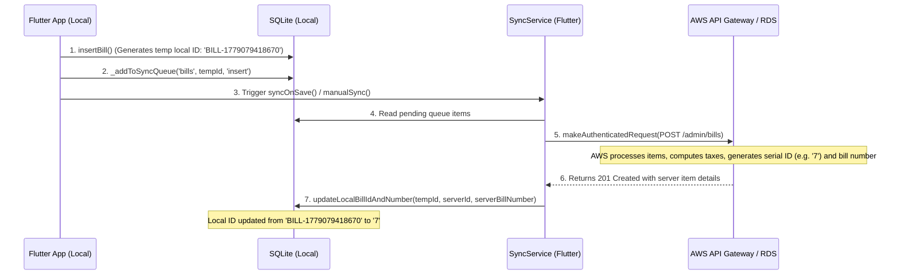

# 💧 A1 Water Tech — Complete Chat & Project State Memory

This document stores the complete history, architectural context, newly added features, and troubleshooting logs for the A1 Water Tech project (Web Storefront, Flutter Admin Mobile App, and AWS Serverless Lambdas).

---

## 📂 Project Structure & Locations
* **Web Storefront (Vite + React)**: `d:\Users\Desktop\The Project\A1 Water Tech\a1-water-online-shop (Web)`
* **Admin Mobile Application (Flutter + Dart)**: `d:\Users\Desktop\The Project\A1 Water Tech\a1_tech_billing (Mobile)`
* **AWS Serverless Lambdas (Node.js)**: `d:\Users\Desktop\The Project\A1 Water Tech\aws-lambdas`
  * Admin Endpoint Proxies: `/prod` via API Gateway targeting `admin.mjs` and `index.mjs`

---

## ⚡ 1. The Mobile-to-Cloud Billing Sync System (Critical Context)

When a bill is generated offline on a physical mobile device, it follows this synchronization flow:

### 🔴 The Synced vs. Pending Sync Visual Distinction
To ensure absolute clarity for the user, a **Cloud Sync Indicator** has been added directly to each card in the **Billing History** screen:
* **Synced to Cloud (AWS)**: Displays a **green check cloud icon (`Icons.cloud_done_rounded`)** with Tooltip "Synced to Cloud". These will have clean server-provided serial IDs (e.g., `7`, `6`, `5`).
* **Local Only (Pending Sync)**: Displays a **red cross cloud icon (`Icons.cloud_off_rounded`)** with Tooltip "Local Only (Pending Sync)". These will have local timestamp-based IDs (e.g., `BILL-1779079418670`).

### 📱 Troubleshooting Physical Device Sync Issues
If bills sync on the emulator (virtual device) but not on the physical Redmi 12 device:
1. **Background Processes Killed by OS**: HyperOS/MIUI are highly aggressive at killing background tasks. The user must manually configure:
   * **Autostart**: Enabled for *A1 Water Billing*.
   * **Battery Saver**: Set to *No Restrictions*.
2. **Network/Security Cleartext**: If the endpoint switches to unencrypted HTTP, cleartext traffic is blocked by default on Android 15. Standard API endpoint uses HTTPS, so this remains safe.
3. **Cognito Token Session**: Verify that the Cognito token is not expired (which blocks authenticated requests). A manual swipe-to-refresh will trigger a refresh token cycle.

---

## 🎨 2. Newly Implemented Features (Search & Premium Filters)

Both the **Online Orders** and **Billing History** screens have been upgraded with high-performance, real-time filters and custom date range Pickers.

### 🔍 Online Orders / Bookings Screen (`lib/screens/orders/orders_screen.dart`)
* **Real-time Query Matching**: Filter by Customer Name, Order/Booking ID, Phone Number, Address, Service/Product Name, and individual items within an order.
* **Date Range Selector**: Tap the calendar icon to select custom ranges. Easily matches order creation dates (`createdAt`) and booking dates (`date`).
* **State Preservation**: Retains selected views between Product Orders and Service Bookings.

### 🧾 Billing History Screen (`lib/screens/billing/bill_history_screen.dart`)
* **Global Search Input**: Matches Bill ID, Bill Number, Customer Name, Phone, and specific items listed inside the bill.
* **Date Range Selector**: Filter history by creation dates.
* **Responsive Layouts**: Designed to perfectly blend with the **Slate & Indigo** theme in both Light and Dark modes.

---

## 🔧 3. Android 15 (API 35) Notification & Autostart Upgrades

We resolved crucial issues on modern Android 15 devices relating to notifications and background autostart:
* **Positive 32-bit Notification IDs**: Enforced casting of string hashcodes using standard bitwise operators (`id.hashCode & 0x7FFFFFFF`) to bypass modern Android crash limits on negative notification IDs.
* **Boot Initialization**: `NotificationService` now explicitly registers and creates the custom `a1_water_tech_channel` on application boot to prevent silent omissions on newer devices.
* **Launcher Icon Alignment**: Corrected the notification launch icon initialization path, changing it from default `ic_launcher` to the custom asset alias `@mipmap/launcher_icon`.

---

## 🛒 4. Web Storefront Updates (`src/pages/OrderSuccess.jsx`)
* **Real-Time Order Tracking**: Replaced static `sessionStorage` with a reactive system polling the `fetchTrackedOrder` Lambda endpoint every 5 seconds.
* **Invisible Iframe Receipt Printing**: Bypasses aggressive mobile browser popup blockers by executing print functions through an invisible sandbox iframe rather than standard `window.open()`.
* **Deployment Optimization**: AWS Amplify deployment package compiled using native folder-preserving `tar` flags to prevent standard folder flattening issues that trigger `404 Not Found` Amplify errors.

---

## 🚀 Instructions for Next Chat / AI Agent
1. **Load this File**: Simply read this file to immediately gain the complete architectural background of the A1 Water Tech platform.
2. **Verify Mobile Compilation**: Run `flutter build apk --split-per-abi` inside the mobile project to compile and prepare a release package for testing.
3. **Check Sync Logs**: If the user is still unable to sync bills from their physical phone, check the terminal outputs of `SyncService` (e.g. print statements on response status codes) during active manual sync triggers.

---
> [!NOTE]
> All changes are fully saved, syntax-checked, and successfully committed to the active directory files. The app is ready to run or be packaged.
